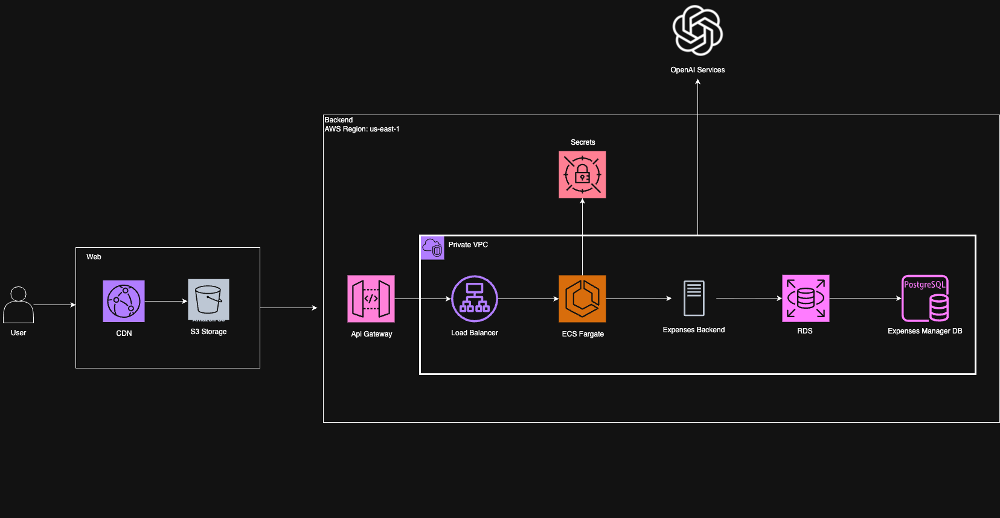

# 💰 Expense Manager

Sistema completo de gestión financiera personal construido con NestJS, React y desplegado en AWS mediante infraestructura como código con Pulumi.

## 🏗️ Estructura del Monorepo

```
expenses/
├── apps/
│   ├── backend/           # API NestJS con Prisma y PostgreSQL
│   │   ├── src/           # Código fuente del backend
│   │   ├── infra/         # Infraestructura Pulumi para AWS
│   │   └── prisma/        # Esquemas y migraciones de DB
│   └── web/               # Frontend React con Vite y TailwindCSS
│       ├── src/           # Código fuente del frontend
│       └── infra/         # Infraestructura Pulumi para S3+CloudFront
├── packages/
│   └── shared/            # DTOs y tipos compartidos
└── package.json           # Scripts del workspace
```

## 🔧 Requisitos

- **Node.js** >= 18
- **pnpm** 9.0.0 (como package manager)
- **Docker** y Docker Compose (para desarrollo local)
- **Pulumi CLI** (para despliegues de infraestructura)
- **AWS CLI** configurado (para despliegues)

## 🚀 Quickstart

### Instalación de dependencias

```bash
pnpm install
```

### Desarrollo local completo

```bash
# Levantar backend y frontend en paralelo, incluyendo base de datos.
pnpm run dev:all

# O por separado:
pnpm run dev:backend    # Backend en http://localhost:3000
pnpm run dev:web        # Frontend en http://localhost:5173
```

### Base de datos local

```bash
cd apps/backend
pnpm run docker:up      # PostgreSQL en Docker
pnpm run db:migrate     # Aplicar migraciones
pnpm run db:studio      # Abrir Prisma Studio
```

## 📋 Comandos Esenciales

| Comando                | Descripción                      |
| ---------------------- | -------------------------------- |
| `pnpm run build`       | Build de todas las aplicaciones  |
| `pnpm run dev`         | Desarrollo de todas las apps     |
| `pnpm run dev:web`     | Solo desarrollo del frontend     |
| `pnpm run dev:backend` | Solo desarrollo del backend      |
| `pnpm run lint`        | Linting de todo el workspace     |
| `pnpm run format`      | Formateo con Prettier            |
| `pnpm run check-types` | Verificación de tipos TypeScript |

## 🔄 Flujo de Desarrollo

1. **Branches**: Usar feature branches desde `main`
2. **Commits**: Convencionales (feat, fix, docs, etc.)
3. **Testing**: Ejecutar tests antes de commits
4. **Code Review**: PRs obligatorios para `main`

## 🚚 CI/CD

El workflow automatizado maneja:

- **Build y test** en cada PR
- **Linting y type checking** automático
- **Deploy a staging** en merge a `main`
- **Deploy a producción** mediante tags

## 📚 Documentación Específica

- [Backend README](./apps/backend/README.md) - API NestJS, base de datos, infraestructura
- [Frontend README](./apps/web/README.md) - Aplicación React, build, despliegue
- [Infraestructura README](./apps/backend/infra/README.md) - Configuración AWS con Pulumi

## 🔐 Variables de Entorno

Revisar los archivos `.env.example` en:

- `apps/backend/.env.example`
- `apps/web/.env.example`

## 🏢 Arquitectura



- **Frontend**: React 19 + Vite + TailwindCSS + Zustand
- **Backend**: NestJS + Prisma + PostgreSQL + OpenAI API
- **Infraestructura**: AWS (ECS Fargate, RDS, ALB, CloudFront, S3)
- **IaC**: Pulumi con TypeScript
- **Monorepo**: pnpm workspaces + Turbo

---

**Tecnologías**: TypeScript, NestJS, React, Prisma, PostgreSQL, AWS, Pulumi, Docker
