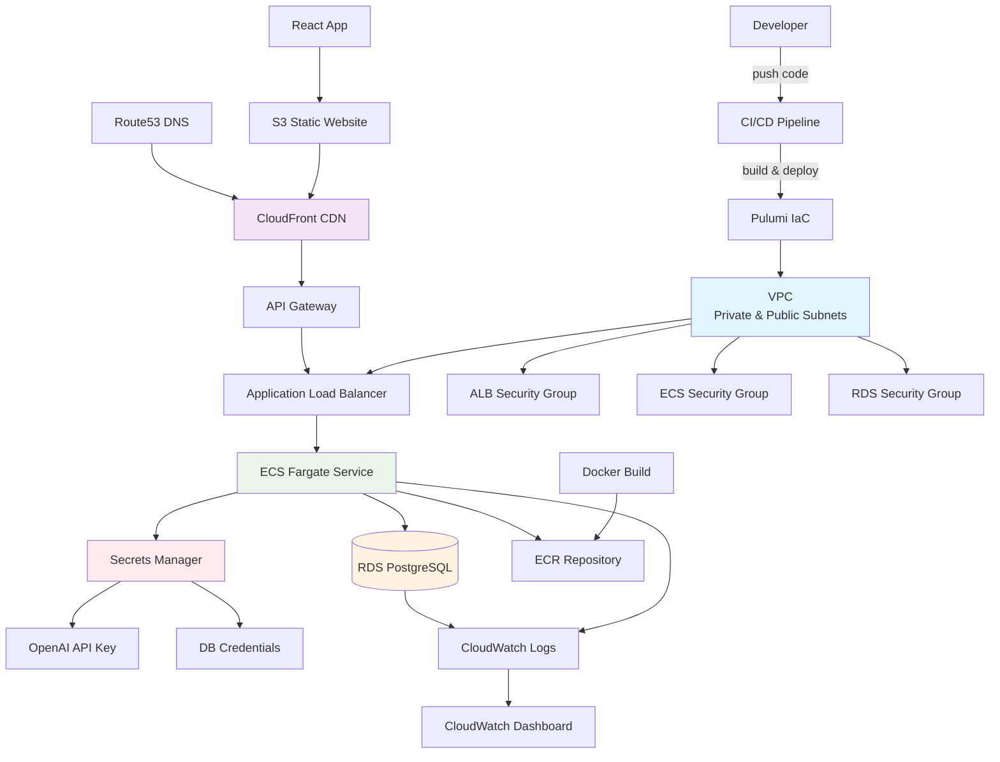

# 🏗️ Infraestructura como Código - AWS con Pulumi

Configuración completa de infraestructura AWS usando Pulumi para desplegar la aplicación Expense Manager en producción con alta disponibilidad y seguridad.

## 📁 Estructura de Proyectos

```
infra/
├── main.ts                 # Stack principal de infraestructura
├── Pulumi.yaml             # Configuración del proyecto
├── Pulumi.dev.yaml         # Configuración del stack dev
├── configs/
│   └── infrastructure.ts   # Variables y configuraciones
├── modules/                # Módulos reutilizables
│   ├── networking/         # VPC, subnets, gateways
│   ├── database/           # RDS PostgreSQL
│   ├── compute/            # ECS Fargate service
│   ├── deployment/         # ECR, ALB, API Gateway, Docker
│   ├── secrets/            # AWS Secrets Manager
│   └── monitoring/         # CloudWatch, logs, dashboards
└── utils/                  # Utilidades compartidas
```

## 🏛️ Arquitectura de Infraestructura



## ⚙️ Configuración de Stacks

### Estado Remoto S3

```bash
# Configurar backend de estado en S3
pulumi login s3://your-pulumi-state-bucket
```

### Variables de Configuración Requeridas

**Stack `dev`** (`Pulumi.dev.yaml`):

```yaml
config:
  aws:region: us-east-1
  stori-backend-infra:environment: dev
  stori-backend-infra:projectName: stori-backend
  stori-backend-infra:dbInstanceClass: db.t3.micro
  stori-backend-infra:dbAllocatedStorage: 20
```

**Secretos requeridos**:

```bash
# Base de datos
pulumi config set stori-backend-infra:dbUsername admin
pulumi config set --secret stori-backend-infra:dbPassword <password>

# JWT y OpenAI
pulumi config set --secret stori-backend-infra:jwtSecret <jwt-secret>
pulumi config set --secret stori-backend-infra:openAiApiKey <openai-key>
```

## 🚀 Comandos de Despliegue

### Comandos básicos

```bash
# Preview de cambios
pnpm run infra:preview

# Deploy completo
pnpm run infra:deploy

# Destruir recursos (CUIDADO)
pnpm run infra:destroy

# Refresh estado actual
pnpm run infra:refresh

# Gestión de stacks
pnpm run infra:stack
```

### Deploy paso a paso

```bash
# 1. Instalar dependencias
cd infra && pnpm install

# 2. Configurar secretos
pulumi config set --secret stori-backend-infra:dbPassword "secure-password"
pulumi config set --secret stori-backend-infra:jwtSecret "jwt-secret-key"
pulumi config set --secret stori-backend-infra:openAiApiKey "sk-..."

# 3. Preview cambios
pulumi preview

# 4. Deploy infraestructura
pulumi up --yes
```

## 🗃️ Recursos AWS Desplegados

### Networking (VPC Module)

- **VPC**: Red privada con CIDR 10.0.0.0/16
- **Subnets públicas**: 2 AZs para balanceador
- **Subnets privadas**: 2 AZs para aplicación y DB
- **Internet Gateway**: Acceso público
- **NAT Gateway**: Acceso saliente desde subnets privadas
- **Route Tables**: Enrutamiento configurado

### Compute (ECS Fargate)

- **ECS Cluster**: Cluster gestionado
- **ECS Service**: Servicio con 1-3 tareas (auto scaling)
- **ECS Task Definition**:
  - CPU: 256 (0.25 vCPU)
  - Memory: 512 MB
  - Puerto: 3000
- **Security Group**: Puerto 3000 desde ALB

### Database (RDS)

- **RDS PostgreSQL**:
  - Instancia: db.t3.micro (dev)
  - Storage: 20GB con auto-scaling
  - Multi-AZ: Habilitado (prod)
  - Backup: 7 días de retención
- **Subnet Group**: Subnets privadas
- **Security Group**: Puerto 5432 desde ECS

### Load Balancing (ALB)

- **Application Load Balancer**: Internet-facing
- **Target Group**: Health checks en `/api`
- **Listener**: HTTPS (puerto 443) + HTTP redirect
- **Security Group**: Puertos 80 y 443 públicos

### API Gateway

- **REST API**: Proxy a ALB interno
- **Throttling**: 1000 requests/sec
- **CORS**: Configurado para frontend
- **Custom Domain**: TODO - configurar dominio

### Container Registry (ECR)

- **ECR Repository**: `expense-manager-backend`
- **Lifecycle Policy**: Mantener últimas 10 imágenes
- **Scan on Push**: Escaneo de vulnerabilidades

### Secrets Management

- **Secrets Manager**:
  - Database URL completa
  - JWT Secret
  - OpenAI API Key
- **IAM Roles**: Acceso mínimo necesario para ECS

### Monitoring (CloudWatch)

- **Log Groups**:
  - `/aws/ecs/expense-manager`
  - `/aws/rds/expense-manager`
- **Dashboard**: Métricas de aplicación y DB
- **Alarms**: TODO - configurar alertas

## 🔐 Seguridad y IAM

### IAM Roles Creados

| Rol                | Descripción          | Permisos                  |
| ------------------ | -------------------- | ------------------------- |
| `EcsTaskRole`      | Rol de la aplicación | Secrets Manager read-only |
| `EcsExecutionRole` | Rol de ejecución ECS | ECR pull, CloudWatch logs |

### Security Groups

| SG       | Puertos | Source    | Descripción            |
| -------- | ------- | --------- | ---------------------- |
| `ALB-SG` | 80, 443 | 0.0.0.0/0 | Internet público       |
| `ECS-SG` | 3000    | ALB-SG    | Solo desde balanceador |
| `RDS-SG` | 5432    | ECS-SG    | Solo desde aplicación  |

### Principios de Seguridad

- **Least Privilege**: Permisos mínimos necesarios
- **Network Isolation**: Subnets privadas para app y DB
- **Encryption**: En tránsito y en reposo
- **Secrets**: Nunca en código, solo en Secrets Manager

## 📊 Monitoreo y Observabilidad

### CloudWatch Metrics

- **ECS**: CPU, memoria, tareas ejecutándose
- **RDS**: Conexiones, CPU, storage, latencia
- **ALB**: Request count, latency, error rate

### Logs Centralizados

```bash
# Ver logs de la aplicación
aws logs tail /aws/ecs/expense-manager --follow

# Ver logs de base de datos
aws logs tail /aws/rds/expense-manager --follow
```

### Dashboard Automático

- **URL**: Disponible en outputs de Pulumi
- **Métricas**: Performance de aplicación y infraestructura
- **Alertas**: TODO - configurar notificaciones

## 🚦 CI/CD Integration

### GitHub Actions Secrets

```yaml
# Requeridos para deploy automático
AWS_ACCESS_KEY_ID: ${{ secrets.AWS_ACCESS_KEY_ID }}
AWS_SECRET_ACCESS_KEY: ${{ secrets.AWS_SECRET_ACCESS_KEY }}
PULUMI_ACCESS_TOKEN: ${{ secrets.PULUMI_ACCESS_TOKEN }}
```

### Workflow de Deploy

```yaml
# TODO: Crear .github/workflows/deploy.yml
name: Deploy Infrastructure
on:
  push:
    branches: [main]
    paths: ['apps/backend/infra/**']
jobs:
  deploy:
    runs-on: ubuntu-latest
    steps:
      - name: Deploy Pulumi Stack
        run: pulumi up --yes
```

## 🔄 Gestión de Entornos

### Stacks Múltiples

```bash
# Desarrollo
pulumi stack select dev
pulumi config set stori-backend-infra:environment dev

# Staging
pulumi stack select staging
pulumi config set stori-backend-infra:environment staging

# Producción
pulumi stack select prod
pulumi config set stori-backend-infra:environment prod
```

### Variables por Entorno

| Variable             | Dev         | Staging     | Prod         |
| -------------------- | ----------- | ----------- | ------------ |
| `dbInstanceClass`    | db.t3.micro | db.t3.small | db.t3.medium |
| `dbAllocatedStorage` | 20          | 50          | 100          |
| `ecsDesiredCount`    | 1           | 2           | 3            |

## 💰 Estimación de Costos

### Entorno Development

- **ECS Fargate**: ~$15/mes (1 tarea)
- **RDS t3.micro**: ~$15/mes
- **ALB**: ~$20/mes
- **NAT Gateway**: ~$30/mes
- **Total**: ~$80/mes

### Entorno Production

- **ECS Fargate**: ~$45/mes (3 tareas)
- **RDS t3.medium**: ~$60/mes
- **ALB**: ~$20/mes
- **NAT Gateway**: ~$30/mes
- **Total**: ~$155/mes

## ⚠️ TODOs

- [ ] Configurar dominio personalizado en API Gateway
- [ ] Implementar certificados SSL automáticos
- [ ] Configurar alertas de CloudWatch
- [ ] Agregar Auto Scaling policies para ECS
- [ ] Implementar backup automatizado de RDS
- [ ] Configurar VPC Flow Logs
- [ ] Agregar WAF para protección de aplicación
- [ ] Implementar blue/green deployments
